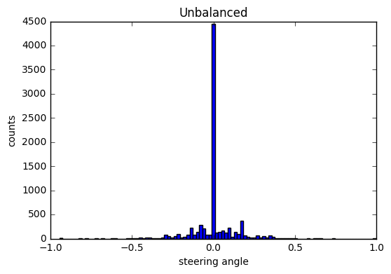
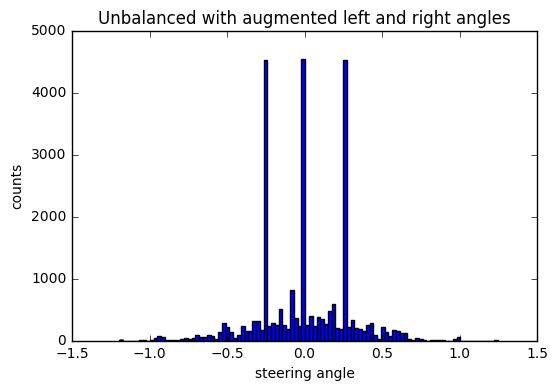
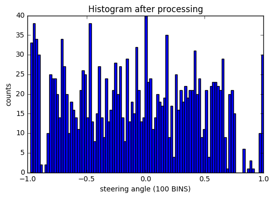
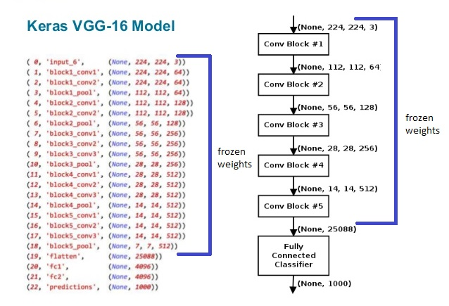

# Project 3: Use Deep Learning to Clone Driving Behavior

Introduction
---
The objective of the project is to train a model to drive a car autonomously on a simulated track. The ability of the model to drive the car is learned from cloning the behaviour of a human driver. Training data is gotten from examples of a human driving in the simulator, then fed into a deep learning network which learns the response (steering angle) for every encountered frame in the simulation. In other words, the model is trained to predict an appropriate steering angle for every frame while driving. The model is then validated on a new track to check for generalization of the learned features for performing steering angle prediction.
Creating a Great Writeup

This project is influenced by [nvidia paper](https://images.nvidia.com/content/tegra/automotive/images/2016/solutions/pdf/end-to-end-dl-using-px.pdf) (though I did not use this model in final architecture), [VGG16](https://arxiv.org/pdf/1409.1556.pdf), [VGG16 model from Keras](https://github.com/fchollet/keras/blob/master/keras/applications/vgg16.py). The Keras Deep Learning library was used with Tensorflow backend, to perform deep learning operations.

Outline 
---
1. **Data Recording**

2. **Data Processing**

3. **Model Training**

4. **Model Testing**

5. **Conclusion**

1.Data Recording
---
Udacity provided a set of training data (24,108 datasets) which can be downloaded with the simulator.
I decided to work with Udacity data from day1 which is the reason why I spend 3 weeks on this project alone. 
Below is histogram of angles from the Udacity dataset.

2.Data Processing
---
You can data pre-processing logic in file, data_preprocess.py.  

Once I have data next step is preprocess the data. I figured out that most important and challenge part of
this project is have right data. If you look at above image there is lot of bias against zero angles and 
there is very less data for angles above +/- 0.5.

The following are the processing steps carried on the data:
1. **Combine center, left and right camera images:** The simulator provides three camera views namely; 
center, left and right views. While using the left and right images, I add and subtract 0.25 to the 
steering angles respectively to make up for the camera offsets 1. 

2. **Add more samples for steering angle more than 0.5 or less then -0.5** If you look at histogram above there
is insufficent data for angle greater than 0.5 or less than -.5. I added more images to insufficent data.
perturb_angle() method in file data_preprocess.py line no.15 does that. Below is the histogram after combining
left, right, center and insufficent images.

3. **Create training and validation data by diving data into bins** Above data looks unbalanced. I created
100 bins.  
Bin start is : 0  
Bin end   is : 1  
Bin step  is : 0.1  
For each bin I have added 19 images in training and validation sets. Code for this can be found in line no 
71, in data_preprocess.py file. I have experimented running model as low as 4 images per bin and I found 19 
images to be optimum. Following is final histogram of training angles after creating bins and adding images
to each bin.

Total training samples:  1733  
Total validation samples: 1448  

This concludes data pre-processing step.

3.Model Training
---
Model training code is in file model.py. I also have model.ipynb file on which I did all data plotting
and experimentation with different models.  

**Batch generator,** method is generate_steering_angle() line number 60. Batch generate is used by model. 
Batch generator before returning batch(size=32) to model iaugments data by adding few more images to 
original image. Batch contains following augmentation of original image:
1. (Original image, angle)
2. (Flipped image, angle). Flipping is required to remove left and right angle bias
3. (Translated image, angle). Translated to simulate car at the edges
4. (Translate flipped image, angle). 

Also, I added brightness to all above images but it is not required to run car on track1. That is more
to generalize the car driving on lane2

This increased training samples by 4X. Now total training samples is 1733 * 4 = 6932

**Model:**

Model code can be found in method, create_model() line number, 112

I trained data on different models like comma.ai, nvidia and VGG16. I used VGG16 model in the end. 
To clone car behavior used Feature extraction approach. Since I have relatively smaller training set
this model worked well. 

VGG16 Architecture below,

Once image go through base model, I flattened the base model and added following regression layer which
have 3 dens layers:  
1. Dense layer with 1000 neurons
2. Dense layer with 250 neurons
3. Dense layer for output value.

Also I used following in the model,  
1. Relu as activation
2. L2 regularization with 0.0001 in regression layer, to prevent overfitting
3. Dropout with 0.5 in regression layer, regularization to prevent overfitting
4. Adam optimizer in model

**EPOCHS:**  
Model used 5 epochs. I tried with epochs raning from 4 to 50. More epochs made car more
wayward and goes like drunken monkey around the track. Lesser 5 epochs worked fine since this is
pre-trained mode1.

Final model is saved is model.h5 and model.json

4.Model Testing
---
The trained model was tested on the first track. This gave a good result, as the car could drive on 
the track smoothly.

Linked to video is submitted with file name video.mp4

5.Conclusion
---

**Notes**

The following are personal notes from working on this project:

1. **Working with limited data is biggest challenge:** Amount of data counts. I had real tough time working 
with only Udacity data. Adding More data would mostly improve the learning efficiency of the model. 
There could have been and much better improvement had I collected more training data but real world 
does not always have enough data. I leanred different data normalization, undersampling techniques and 
some of them were real creative.

2. **Data processing is as important as learning process:** The most important part of this project was 
to come up with a data processing that anticipates test cases and generalize, hence the use of flip, 
translate and brightness augmentation.

**Future work**
* Incorporate augmented shadows in the training to make it more robust
* See how well a simulator learned model works on real world data
* Test different hyper-parameters, such as learning rate, dropout probability, steering angle offsets, etc.
* More agressive crop to the images before feeding them to the neural net. 
* Build model with less paramters

Overall this model gave me great opportunity to learn. Planning to use Udacity data was great decision.
Spending 3 weeks on this helped me to explore and experiment with differnet data pre-processing / augmentation and models.
